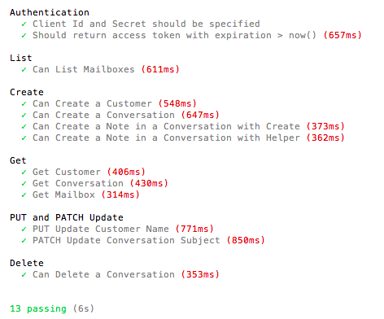

# Help Scout Mailbox API 2.0 Client - Node.js

[](https://github.com/mcdado/node-helpscout/actions/workflows/publish_on_release.yml)

## About this Module

This module was built to make using [Help Scout's Inbox API 2.0](https://developer.helpscout.com/mailbox-api/)
endpoints as easy as possible.

It contains wrappers around each type of endpoint (Create, List, Update, etc.) to manage the authentication,
error handling, and other stuff you probably don't want to spend a lot of time coding for.

This module supports the Client Credentials Flow authentication method which is suited for apps you can create and
manage, ideally suited for internal projects.

_Disclaimer: This module is not in any way affiliated to or supported by Help Scout Inc._
_It's an open-source act of love to get to the fun part of writing code faster._

## Installation

```sh
$ npm install node-helpscout
```

## Initialization

**Create an OAuth2 Application**
First things first, [create an OAuth2 Application](https://developer.helpscout.com/mailbox-api/overview/authentication/#oauth2-application)
under your profile in Help Scout. We won't be using the OAuth flow so the redirect URL is not needed to use this module.

**Import the Module and Create a Client**
All API Methods are made available via a Help Scout _Client_. Once you create your OAuth2 application, we'll use the
App Id and Secret provided to authenticate your API Calls.

It may look something like this when you're done:

```js
const NodeHelpScout = require("node-helpscout");

const HelpScoutClient = new NodeHelpScout({
    clientId: process.env.HELPSCOUT_CLIENT_ID,
    clientSecret: process.env.HELPSCOUT_APP_SECRET,
});
```

🎉 **Awesome**! You now have a client that can use all of the helper methods below.

## Testing

A full test suite is available for your convenience.

**Step 1:** Create a file called `.env` in the root directory of this project and add add `HELPSCOUT_CLIENT_ID` and
`HELPSCOUT_CLIENT_SECRET` to provide your Client Id and Secret obtained above.

**Step 2:** Run the tests

```sh
$ npm test
```

The output should look something like this:



## Features

This library returns **promises** to allow use of async/await. TypeScript **type definitions** are provided for all the methods.

# HTTP Methods

## create();

Create a new Resource.

```js
await HelpScoutClient.create(resource, data, parentResource, parentResourceId);
```

**resource:** Type of Resource to create ("conversations", "customers", ..)

**data:** Object containing the resource data

**parentResource:** Optional field to support resources that are created below an existing resource.

**parentResourceId:** Optional field indicating Id the parent resource that this resource should be created under.

**Example: Create a new Customer**

```js
const customer = {
    firstName: "John",
    lastName: "Doe",
    emails: [{ type: "work", value: "johndoe@gmail.com" }],
};

const customerId = await HelpScoutClient.create("customers", customer);
```

**Example2: Create a new note in a conversation**

```js
const conversationId = 123456789;
await HelpScoutClient.create(
    "notes",
    { text: "An example note." },
    "conversations",
    conversationId
);
```

_Note: [No id is passed from Help Scout](https://developer.helpscout.com/mailbox-api/endpoints/conversations/threads/note/#response) when creating child objects like notes._

## list();

Get a list of Resources, this module handles the pagination and rate-limiting for you. If no results are returned, an empty array is returned.

```js
const resourceArray = await HelpScoutClient.list(
    resource,
    queryParams,
    parentResource,
    parentResourceId
);
```

**resource:** Type of Resource to list ("conversations", "customers", ..)

**queryParams:** Query String to use - Help Scout supports a ton of super cool, super complex query strings like
[this](https://developer.helpscout.com/mailbox-api/endpoints/conversations/list/#query)
or [this](https://developer.helpscout.com/mailbox-api/endpoints/customers/list/#query).
This parameter expects a string to put after the "?" in the request, do _not_ include the "?" mark in the string
you pass in.

**parentResource:** Optional field to support resources that are created below an existing resource.

**parentResourceId:** Optional field indicating Id the parent resource that this resource should be created under.

**Example: Get all Mailboxes**

```js
const mailboxArray = await HelpScoutClient.list("mailboxes");
```

**Example: Get all Customers**

```js
const customersArray = await HelpScoutClient.list("customers", null, "", "");
```

## get();

Get a specific resource based on an id

```js
const resource = await HelpScoutClient.get(
    type,
    resourceId,
    embeddables,
    subType
);
```

**resource:** Type of Resource to get ("conversations", "customers", ..)

**resourceId:** Id of the resource you'd like to retrieve.

**embeddables:** On certain endpoints like Customers,
[Help Scout requires you explicitly ask for any lists of related resources](https://developer.helpscout.com/mailbox-api/endpoints/customers/get/#url-parameters).
Pass in an array of related resource labels (as strings) to have those included in the object that comes back, see Example 1 below.

**subType:** Optional field for certain endpoints to return an **array** of Resources below the Resource you're getting,
see Example 2 below.

**Example 1: Get Customers with Emails and Social Profiles**

```js
const customer = await HelpScoutClient.get(
    "customers",
    123456789,
    ["emails", "social_profiles"],
    ""
);
```

**Example 2: Get Folders in a Mailbox**

```js
const foldersArr = await HelpScoutClient.get(
    "mailboxes",
    166129,
    "",
    "folders"
);
```

## updatePut();

For certain Help Scout Endpoints, you'll want to use the "PUT" method when updating a Resource.
The PUT method replaces all of the Resource's properties with the data you specify.

```js
await HelpScoutClient.updatePut(
    resource,
    resourceId,
    data,
    parentResource,
    parentResourceId
);
```

**resource:** Type of Resource to update ("conversations", "customers", ..)

**resourceId:** Optional, Id of the resource you'd like to update. (i.e. Email Address for Customer)

**data:** Object containing the resource data that will replace the current data

**parentResource:** Optional field to support resources that are updated below an existing resource.

**parentResourceId:** Optional field indicating Id the parent resource that this resource should be updated under.

**Example: Update Email Address for a Customer**

```js
await HelpScoutClient.updatePut(
    "emails",
    123456789,
    {
        type: "work",
        value: "test4@gmail.com",
    },
    "customers",
    987654321
);
```

## updatePatch();

For certain Help Scout Endpoints, you'll want to use the "PATCH" method when updating a Resource. The PATCH method updates specific Resource properties while leaving other properties untouched. I highly recommend reviewing [HelpScout's documentation of patching](https://developer.helpscout.com/mailbox-api/endpoints/conversations/update/).

```js
await HelpScoutClient.updatePut(
    resource,
    resourceId,
    data,
    parentResource,
    parentResourceId
);
```

**resource:** Type of Resource to update ("conversations", "customers", ..)

**resourceId:** Id of the resource you'd like to update.

**data:** Object containing the resource data that will replace the current data

**parentResource:** Optional field to support resources that are updated below an existing resource.

**parentResourceId:** Optional field indicating Id the parent resource that this resource should be updated under.

**Example: Update Conversation Subject Line**

```js
await HelpScoutClient.updatePatch(
    "conversations",
    712477488,
    {
        op: "replace",
        path: "/subject",
        value: "Super cool new subject",
    },
    "",
    ""
);
```

# Business Helpers

Some common operations require a couple of steps. The following methods simplify these operations with a simple call.
For example, adding a note to a conversation. Try this:

For example, adding a note to a conversation. I feel it's a better experience to support something like:

```js
await HelpScoutClient.addNoteToConversation(convoId, "Test Note");
```

as opposed to

```js
await HelpScoutClient.create(
    "notes",
    { text: "Test Note" },
    "conversations",
    convoId
);
```

# Public Base Methods

## authenticate();

Note: This should never need to be called by your code directly, but it's provided if you ever need the access tokens for testing or debugging.

```js
HelpScoutClient.authenticate();
```

The `apiTokens` property object has the following properties:

```ts
HelpScoutClient.apiTokens: {
    accessToken: string
    refreshToken: string
    expiresAt: number
}
```

"expiresAt" is the epoch expiration time calculated to make comparing to Date.now().

## sendApiRequest();

If you want to leverage the authentication that comes with the client, but need to query something super specific or not covered by this module, this method is for you.

```js
HelpScoutClient.sendApiRequest(method, url, data);
```

**method:** HTTP Method (GET, POST, DELETE, etc.)

**url:** Full URL, including everything from https:// to the query string.

**data:** For POST/PATCH/PUT requests, specify the data we should post to the URL

## Help Wanted

This was put together as a project to help developers get developing quickly on the Help Scout platform.
If you have an idea about how to extend this, want to contribute, or notice any issues, please file an Issue on Github.

## License

This module is provided as an open-source project under the MIT License, it is not in any way supported or affiliated with Help Scout Inc.
